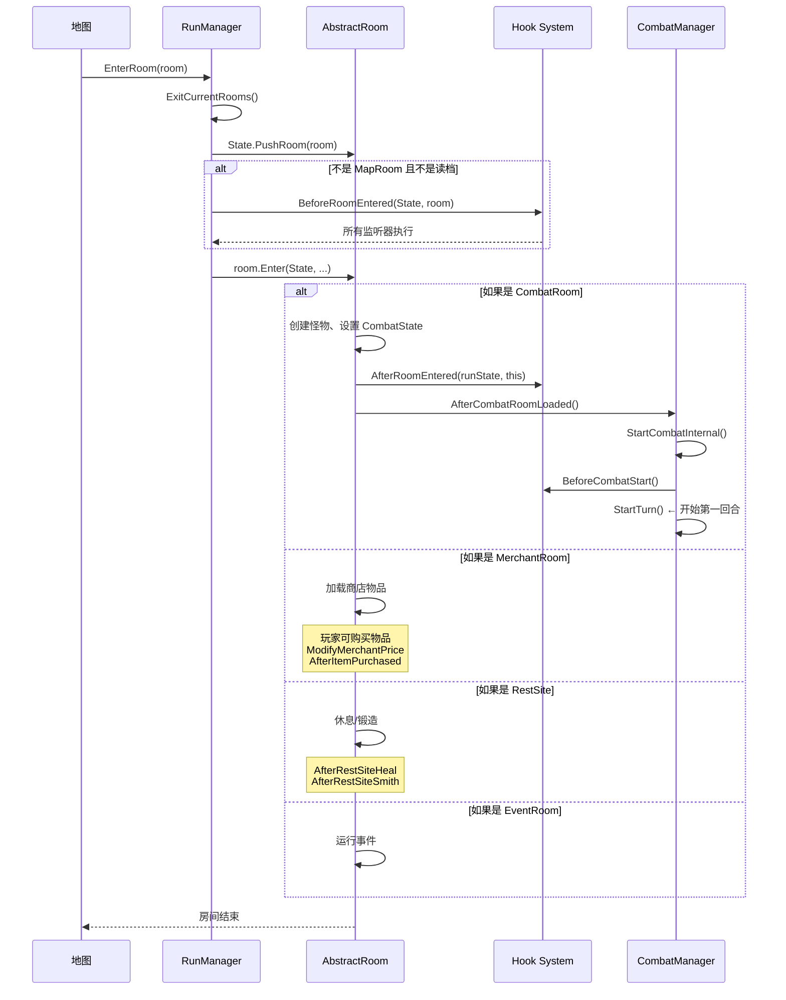
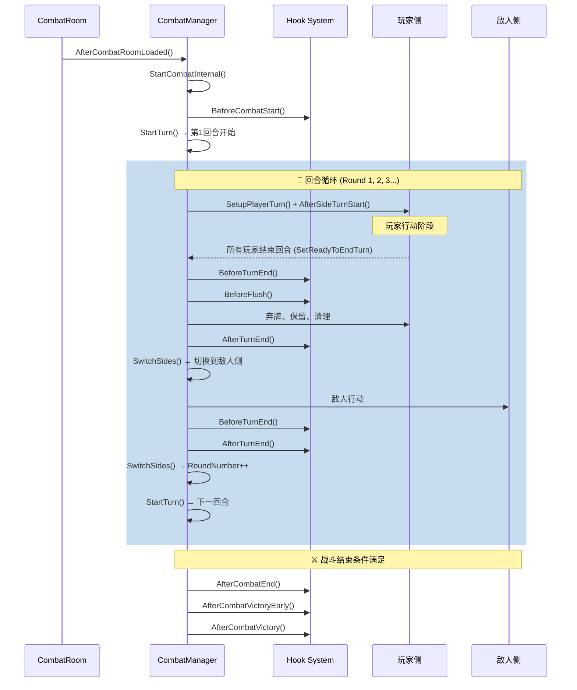
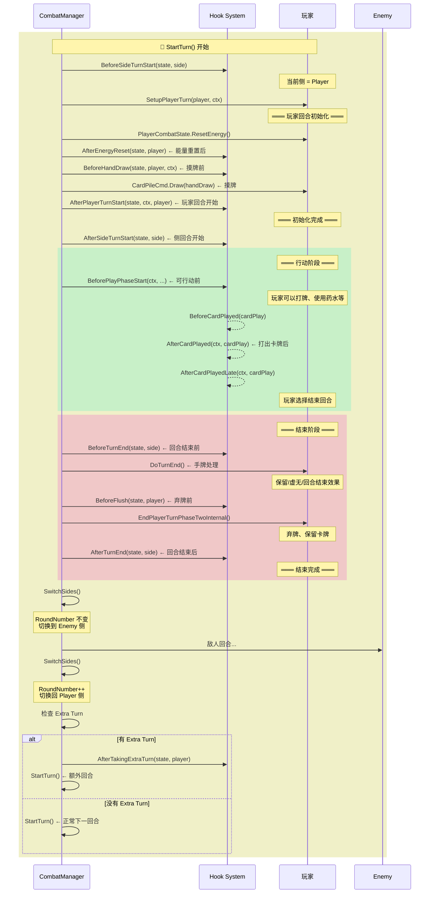

# STS2 战斗流程完整钩子(Hook)生命周期

> 基于 `e:\STS2` 源码分析
> 核心文件: `Hook.cs`, `CombatManager.cs`, `RunManager.cs`, `CombatRoom.cs`

---

## 目录

1. [整体游戏流程（房间级）](#1-整体游戏流程房间级)
2. [战斗内部完整流程](#2-战斗内部完整流程)
3. [单回合详细流程（玩家侧）](#3-单回合详细流程玩家侧)
4. [单回合详细流程（敌人侧）](#4-单回合详细流程敌人侧)
5. [所有 Hook 参考表](#5-所有-hook-参考表)
6. [非战斗 Hook 一览](#6-非战斗-hook-一览)
7. [最佳实践与常见陷阱](#7-最佳实践与常见陷阱)

---

## 1. 整体游戏流程（房间级）



### 房间进入关键代码

**RunManager.cs (L893-903):**
```
1. Hook.BeforeRoomEntered(State, room)
2. room.Enter(State, ...)
```

**CombatRoom.cs (L200-210):**
```
1. 创建怪物 (CombatState.CreateCreature)
2. CombatManager.Instance.SetUpCombat(CombatState)
3. Hook.AfterRoomEntered(runState, this)   ← 进入房间后
4. CombatManager.Instance.AfterCombatRoomLoaded()
   └→ StartCombatInternal()
      ├─ Hook.BeforeCombatStart()
      └─ StartTurn()  ← 开始战斗
```

---

## 2. 战斗内部完整流程



---

## 3. 单回合详细流程（玩家侧）

这是最关键的部分，展示了每一回合玩家的完整流程：



### 完整玩家回合调用顺序（精确到调用点）

```
StartTurn()  ← 回合开始
│
├─ Hook.BeforeSideTurnStart(state, state.CurrentSide)        [CM:L281]
│   └─ 每个监听器: model.BeforeSideTurnStart(side, state)
│
├─ [如果是 Player 侧]
│   │
│   ├─ SetupPlayerTurn(player, ctx)                          [CM:~L430]
│   │   ├─ player.PlayerCombatState.ResetEnergy()            ← 重置能量
│   │   ├─ Hook.AfterEnergyReset(state, player)              [Hook:L360]
│   │   │   ├─ model.AfterEnergyReset(player)
│   │   │   └─ model.AfterEnergyResetLate(player)
│   │   ├─ Hook.BeforeHandDraw(state, player, ctx)           [Hook:L368]
│   │   │   ├─ model.BeforeHandDraw(player, ctx, state)
│   │   │   └─ model.BeforeHandDrawLate(player, ctx, state)
│   │   ├─ CardPileCmd.Draw(handDraw, player)                ← 摸牌
│   │   └─ Hook.AfterPlayerTurnStart(state, ctx, player)     [Hook:L377]
│   │       ├─ model.AfterPlayerTurnStartEarly(ctx, player)
│   │       ├─ model.AfterPlayerTurnStart(ctx, player)
│   │       └─ model.AfterPlayerTurnStartLate(ctx, player)
│   │
│   ├─ Hook.AfterSideTurnStart(state, state.CurrentSide)     [CM:L341]
│   │   ├─ model.AfterSideTurnStart(side, state)
│   │   └─ model.AfterSideTurnStartLate(side, state)
│   │
│   ├─ [OrbQueue.AfterTurnStart]
│   │
│   ├─ Hook.BeforePlayPhaseStart(ctx, task, state, player)   [CM:L385]
│   │   ├─ model.BeforePlayPhaseStart(ctx, player)
│   │   └─ model.BeforePlayPhaseStartLate(ctx, player)
│   │
│   ├─ ═══ 玩家行动阶段 (打牌等) ═══
│   │   ├─ 打出卡牌时:
│   │   │   ├─ Hook.BeforeCardPlayed(cardPlay)               [Hook:~L165]
│   │   │   └─ Hook.AfterCardPlayed(ctx, cardPlay)           [Hook:L181]
│   │   │       ├─ model.AfterCardPlayed(ctx, cardPlay)
│   │   │       └─ model.AfterCardPlayedLate(ctx, cardPlay)
│   │   ├─ 能量变化时:
│   │   │   └─ Hook.AfterEnergySpent(state, card, amount)
│   │   └─ 玩家点击"结束回合"
│   │
│   ├─ ═══ 回合结束阶段 ═══
│   │
│   ├─ EndPlayerTurnPhaseOneInternal()
│   │   ├─ Hook.BeforeTurnEnd(state, state.CurrentSide)      [Hook:L747]
│   │   │   ├─ model.BeforeTurnEndVeryEarly(state, side)
│   │   │   ├─ model.BeforeTurnEndEarly(state, side)
│   │   │   └─ model.BeforeTurnEnd(state, side)
│   │   ├─ DoTurnEnd(player, ctx)                            ← 手牌处理
│   │   │   ├─ OrbQueue.BeforeTurnEnd(ctx)
│   │   │   ├─ 处理 Ethereal (虚无) 卡牌
│   │   │   └─ card.OnTurnEndInHand(ctx)                     ← 回合结束效果
│   │   └─ Hook.BeforeFlush(state, player)                   [Hook:L343]
│   │       ├─ model.BeforeFlush(ctx, player)
│   │       └─ model.BeforeFlushLate(ctx, player)
│   │
│   ├─ EndPlayerTurnPhaseTwoInternal()
│   │   ├─ 处理 Retain (保留) 卡牌
│   │   │   └─ Hook.AfterCardRetained(state, card)
│   │   ├─ 丢弃剩余手牌 (ShouldFlush)
│   │   ├─ player.PlayerCombatState.EndOfTurnCleanup()
│   │   └─ Hook.AfterTurnEnd(state, state.CurrentSide)       [Hook:L769]
│   │       ├─ model.AfterTurnEnd(state, side)
│   │       └─ model.AfterTurnEndLate(state, side)
│   │
│   └─ SwitchFromPlayerToEnemySide()
│       ├─ Hook.ShouldTakeExtraTurn()                        ← 检查额外回合
│       ├─ SwitchSides() → 切换到 Enemy 侧
│       ├─ Hook.AfterTakingExtraTurn(state, player)          (如果有)
│       └─ StartTurn()  → 敌人回合
```

---

## 4. 单回合详细流程（敌人侧）

```
StartTurn()  ← 敌人回合开始
│
├─ Hook.BeforeSideTurnStart(state, state.CurrentSide)        [CM:L281]
│
├─ [如果是 Enemy 侧]
│   ├─ 显示敌人回合Banner
│   ├─ creature.AfterTurnStart(roundNumber, side)
│   ├─ Hook.AfterBlockCleared(state, creature)               ← 清除格挡
│   │
│   ├─ Hook.AfterSideTurnStart(state, state.CurrentSide)     [CM:L341]
│   │
│   ├─ 敌人行动:
│   │   └─ ExecuteEnemyTurn()  ← AI 打牌
│   │
│   ├─ ═══ 敌人回合结束 ═══
│   │
│   ├─ EndEnemyTurnInternal()
│   │   ├─ Hook.BeforeTurnEnd(state, state.CurrentSide)
│   │   ├─ player.PlayerCombatState.EndOfTurnCleanup()
│   │   └─ Hook.AfterTurnEnd(state, state.CurrentSide)
│   │
│   └─ SwitchSides() → 切换回 Player 侧, RoundNumber++
│       └─ StartTurn()  → 玩家下一回合
```

---

## 5. 所有 Hook 参考表

### 5.1 房间/战斗生命周期

| Hook 方法 | 调用时机 | 关键参数 | 作用域 |
|-----------|---------|---------|--------|
| `BeforeRoomEntered(room)` | 进入任何房间前 | `AbstractRoom` | 全局 (runState) |
| `AfterRoomEntered(room)` | 进入房间后(战斗房间在怪物创建后) | `AbstractRoom` | 全局 (runState) |
| `BeforeCombatStart()` | 战斗开始前, Banner 显示前 | 无 | 全局+战斗 |
| `BeforeCombatStartLate()` | `BeforeCombatStart` 之后 | 无 | 全局+战斗 |
| `AfterCombatEnd(room)` | 战斗结束时(胜/负) | `CombatRoom` | 全局+战斗 |
| `AfterCombatVictoryEarly(room)` | 战斗胜利时(早阶段) | `CombatRoom` | 全局+战斗 |
| `AfterCombatVictory(room)` | 战斗胜利时(晚阶段) | `CombatRoom` | 全局+战斗 |

### 5.2 回合生命周期

| Hook 方法 | 调用时机 | 关键参数 | 作用域 |
|-----------|---------|---------|--------|
| `BeforeSideTurnStart(side, state)` | 任何侧回合开始前 | `CombatSide` | 战斗 |
| `AfterSideTurnStart(side, state)` | 侧回合开始后(玩家初始化后) | `CombatSide` | 战斗 |
| `AfterSideTurnStartLate(side, state)` | `AfterSideTurnStart` 之后 | `CombatSide` | 战斗 |
| `BeforeTurnEndVeryEarly(side, state)` | 回合结束前(最早) | `CombatSide` | 战斗 |
| `BeforeTurnEndEarly(side, state)` | 回合结束前(较早) | `CombatSide` | 战斗 |
| `BeforeTurnEnd(side, state)` | 回合结束前 | `CombatSide` | 战斗 |
| `AfterTurnEnd(side, state)` | 回合结束后 | `CombatSide` | 战斗 |
| `AfterTurnEndLate(side, state)` | `AfterTurnEnd` 之后 | `CombatSide` | 战斗 |
| `AfterTakingExtraTurn(player)` | 额外回合开始时 | `Player` | 战斗 |

### 5.3 玩家回合初始化 (SetupPlayerTurn 内部)

| Hook 方法 | 调用时机 | 关键参数 | 作用域 |
|-----------|---------|---------|--------|
| `AfterEnergyReset(player)` | 能量重置后 | `Player` | 战斗 |
| `AfterEnergyResetLate(player)` | `AfterEnergyReset` 之后 | `Player` | 战斗 |
| `BeforeHandDraw(player, ctx, state)` | 摸牌前 | `Player, PlayerChoiceContext` | 战斗 |
| `BeforeHandDrawLate(player, ctx, state)` | `BeforeHandDraw` 之后 | `Player, PlayerChoiceContext` | 战斗 |
| `AfterPlayerTurnStartEarly(ctx, player)` | 摸牌后(早阶段) | `PlayerChoiceContext, Player` | 战斗 |
| `AfterPlayerTurnStart(ctx, player)` | 摸牌后 | `PlayerChoiceContext, Player` | 战斗 |
| `AfterPlayerTurnStartLate(ctx, player)` | 摸牌后(晚阶段) | `PlayerChoiceContext, Player` | 战斗 |
| `BeforePlayPhaseStart(ctx, player)` | 行动阶段开始前 | `HookPlayerChoiceContext, Player` | 战斗 |
| `BeforePlayPhaseStartLate(ctx, player)` | `BeforePlayPhaseStart` 之后 | `HookPlayerChoiceContext, Player` | 战斗 |

### 5.4 回合结束阶段 (EndPlayerTurnPhaseOne 内部)

| Hook 方法 | 调用时机 | 关键参数 | 作用域 |
|-----------|---------|---------|--------|
| `BeforeFlush(ctx, player)` | 弃牌前 | `HookPlayerChoiceContext, Player` | 战斗 |
| `BeforeFlushLate(ctx, player)` | `BeforeFlush` 之后 | `HookPlayerChoiceContext, Player` | 战斗 |
| `AfterCardRetained(card)` | 保留卡牌后 | `CardModel` | 战斗 |

### 5.5 卡牌相关

| Hook 方法 | 调用时机 | 关键参数 | 作用域 |
|-----------|---------|---------|--------|
| `BeforeCardPlayed(cardPlay)` | 打出卡牌前 | `CardPlay` | 战斗 |
| `AfterCardPlayed(ctx, cardPlay)` | 打出卡牌后 | `PlayerChoiceContext, CardPlay` | 战斗 |
| `AfterCardPlayedLate(ctx, cardPlay)` | `AfterCardPlayed` 之后 | `PlayerChoiceContext, CardPlay` | 战斗 |
| `BeforeCardAutoPlayed(card, target, type)` | 自动打出卡牌前 | `CardModel, Creature, AutoPlayType` | 战斗 |
| `AfterCardChangedPiles(card, oldPile, source)` | 卡牌牌堆改变后 | `CardModel, PileType` | 全局+战斗 |
| `BeforeCardRemoved(card)` | 移除卡牌前 | `CardModel` | 全局 (runState) |

### 5.6 伤害/格挡相关

| Hook 方法 | 调用时机 | 关键参数 | 作用域 |
|-----------|---------|---------|--------|
| `BeforeAttack(command)` | 攻击前 | `AttackCommand` | 战斗 |
| `AfterAttack(command)` | 攻击后 | `AttackCommand` | 战斗 |
| `BeforeBlockGained(creature, amount, props, cardSource)` | 获得格挡前 | `Creature, decimal` | 战斗 |
| `AfterBlockGained(creature, amount, props, cardSource)` | 获得格挡后 | `Creature, decimal` | 战斗 |
| `AfterBlockCleared(creature)` | 格挡被清除后 | `Creature` | 战斗 |
| `AfterBlockBroken(creature)` | 格挡被击破后 | `Creature` | 战斗 |
| `BeforeDamageReceived(ctx, target, amount, ...)` | 受到伤害前 | `PlayerChoiceContext, Creature` | 全局+战斗 |
| `AfterDamageReceived(ctx, target, result, ...)` | 受到伤害后 | `PlayerChoiceContext, Creature` | 全局+战斗 |
| `AfterDamageReceivedLate(ctx, target, result, ...)` | `AfterDamageReceived` 之后 | `PlayerChoiceContext, Creature` | 全局+战斗 |
| `AfterDamageGiven(ctx, state, dealer, results, ...)` | 造成伤害后 | `PlayerChoiceContext, Creature` | 战斗 |
| `AfterCurrentHpChanged(creature, delta)` | HP 改变后 | `Creature, decimal` | 全局+战斗 |
| `BeforeDeath(creature)` | 死亡前 | `Creature` | 全局+战斗 |
| `AfterDiedToDoom(ctx, creatures)` | 死于 doom 后 | `List<Creature>` | 战斗 |

### 5.7 能量相关

| Hook 方法 | 调用时机 | 关键参数 | 作用域 |
|-----------|---------|---------|--------|
| `AfterEnergyReset(player)` | 能量重置后 | `Player` | 战斗 |
| `AfterEnergyResetLate(player)` | `AfterEnergyReset` 之后 | `Player` | 战斗 |
| `AfterEnergySpent(card, amount)` | 消耗能量后 | `CardModel, int` | 战斗 |

### 5.8 增益/减益(Power)相关

| Hook 方法 | 调用时机 | 关键参数 | 作用域 |
|-----------|---------|---------|--------|
| `BeforePowerAmountChanged(power, amount, ...)` | Power 层数变化前 | `PowerModel, decimal` | 战斗 |
| `AfterPowerAmountChanged(power, amount, ...)` | Power 层数变化后 | `PowerModel, decimal` | 战斗 |

### 5.9 卡牌奖励相关

| Hook 方法 | 调用时机 | 关键参数 | 作用域 |
|-----------|---------|---------|--------|
| `TryModifyCardRewardOptions(player, cardRewardOptions, options)` | 生成奖励卡牌时(先) | `List<CardCreationResult>` | 全局 (runState) |
| `TryModifyCardRewardOptionsLate(player, cardRewardOptions, options)` | 生成奖励卡牌时(后) | `List<CardCreationResult>` | 全局 (runState) |
| `ModifyCardRewardUpgradeOdds(player, card, odds)` | 修改升级概率 | `CardModel, decimal` | 全局 (runState) |
| `TryModifyCardRewardAlternatives(player, cardReward, alternatives)` | 修改卡牌替换选项 | `CardReward` | 全局 (runState) |
| `AfterModifyingCardRewardOptions()` | 卡牌奖励修改后 | 无 | 全局 (runState) |
| `BeforeRewardsOffered(player, rewards)` | 奖励展示前 | `IReadOnlyList<Reward>` | 全局 (runState) |
| `AfterRewardTaken(player, reward)` | 领取奖励后 | `Reward` | 全局 (runState) |

### 5.10 商店相关

| Hook 方法 | 调用时机 | 关键参数 | 作用域 |
|-----------|---------|---------|--------|
| `ModifyMerchantPrice(player, entry, cost)` | 计算商品价格时 | `Player, MerchantEntry, decimal` | 全局 (runState) |
| `AfterItemPurchased(player, item, goldSpent)` | 购买物品后 | `Player, MerchantEntry, int` | 全局 (runState) |

### 5.11 休息/锻造相关

| Hook 方法 | 调用时机 | 关键参数 | 作用域 |
|-----------|---------|---------|--------|
| `AfterRestSiteHeal(player, isMimicked)` | 休息处回血后 | `Player, bool` | 全局 (runState) |
| `AfterRestSiteSmith(player)` | 休息处锻造后 | `Player` | 全局 (runState) |

---

## 6. 非战斗 Hook 一览

| Hook 方法 | 调用时机 | 关键参数 |
|-----------|---------|---------|
| `AfterActEntered()` | 进入新 Act 后 | 无 |
| `AfterMapGenerated(map, actIndex)` | 地图生成后 | `ActMap, int` |
| `ModifyNextEvent(currentEvent)` | 修改下一个事件 | `EventModel` |
| `ModifyCardRewardCreationOptions(player, options)` | 修改卡牌奖励创建选项 | `CardCreationOptions` |
| `ModifyCardRewardCreationOptionsLate(player, options)` | (晚阶段) | `CardCreationOptions` |
| `AfterCreatureAddedToCombat(creature)` | 生物加入战斗后 | `Creature` |
| `AfterPreventingDeath(creature)` | 防止死亡后 | `Creature` |
| `AfterPreventingDraw()` | 防止摸牌后 | 无 |

---

## 7. 最佳实践与常见陷阱

### 7.1 Hook 执行顺序关键点

```
时间线 → 
─────────────────────────────────────────────────────────────
                玩家回合                         敌人回合
                ↓                                 ↓
AfterRoomEntered → BeforeCombatStart → [SetupPlayerTurn → AfterSideTurnStart → ... → BeforeTurnEnd → AfterTurnEnd] → [敌人回合...] → [下一回合...]
                                       │
                                       ├─ AfterEnergyReset    ← 能量重置后
                                       ├─ BeforeHandDraw      ← 摸牌前
                                       ├─ AfterPlayerTurnStart ← 摸牌后
                                       ├─ AfterSideTurnStart  ← 侧回合开始
                                       └─ BeforePlayPhaseStart ← 可行动前
```

### 7.2 常见陷阱

| 陷阱 | 原因 | 正确做法 |
|------|------|---------|
| **`AfterRoomEntered` 加能量被覆盖** | `ResetEnergy()` 在 `StartTurn()` 中调用 | 使用 `AfterEnergyReset` Hook |
| **`BeforeCombatStart` 加增益延迟** | 战斗开场动画在 Hook 之后 | 将效果放在 `StartTurn` 后才生效 |
| **修改奖励卡牌时未 Clone** | 直接修改原卡牌会导致状态混乱 | 使用 `RunState.CloneCard()` + `ModifyCard()` |
| **多人模式未检查玩家身份** | 所有玩家都会收到 Hook 事件 | 添加 `if (player != base.Owner) return;` |
| **`IsUsedUp` 设错时机** | 购买后立即标记失效，但效果还在 | 离开房间时才标记为已用尽 |

### 7.3 常见用途对照

| 想实现的效果 | 应使用的 Hook |
|-------------|--------------|
| 战斗开始时给玩家加增益 | `BeforeCombatStart()` 或 `AfterSideTurnStart(side=Player)` |
| 每回合开始给能量 | `AfterEnergyReset()` |
| 每回合开始给抽牌 | `BeforeHandDraw()` 或 `AfterPlayerTurnStart()` |
| 每回合开始摸牌后触发 | `AfterPlayerTurnStart()` |
| 玩家行动前设置 | `BeforePlayPhaseStart()` |
| 追踪卡牌打出次数 | `AfterCardPlayed()` |
| 回合结束时触发效果 | `BeforeTurnEnd()` 或 `AfterTurnEnd()` |
| 弃牌前拦截 | `BeforeFlush()` |
| 战斗结束时触发 | `AfterCombatEnd()` (胜/负)/ `AfterCombatVictory()` (仅胜利) |
| 商店物品降价 | `ModifyMerchantPrice()` |
| 购买物品后触发 | `AfterItemPurchased()` |
| 修改奖励卡牌 | `TryModifyCardRewardOptions()` / `TryModifyCardRewardOptionsLate()` |
| 休息处回血后 | `AfterRestSiteHeal()` |
| 格挡变化时 | `AfterBlockGained()` |
| Power 层数变化时 | `AfterPowerAmountChanged()` |
| 造成伤害时 | `AfterDamageGiven()` |
| 受到伤害时 | `AfterDamageReceived()` |

---

> 本文档基于 STS2 源码 `Hook.cs`, `CombatManager.cs`, `RunManager.cs`, `CombatRoom.cs` 生成
> 最后更新: 2026-05-06
